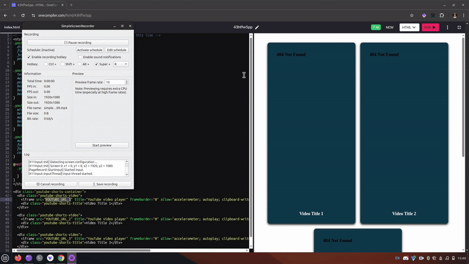

# 📱 YouTube Shorts for Shopify

**Showcase your YouTube Shorts on your Shopify product pages with zero coding required!**

## 🚀 Easy 5-Minute Setup

### Step 1: Copy the Code
Simply copy the entire code block from the "YouTube Shorts for Shopify" file.

### Step 2: Add to Your Shopify Store
1. Log in to your **Shopify admin dashboard**
2. Click on **Online Store** in the left sidebar
3. Click the **Customize** button
4. Navigate to your **product page**
5. On the left side, click **Add section**
6. Scroll down and select **Custom Liquid**
7. In the Custom Liquid box, **paste the entire code** you copied earlier

### Step 3: Add Your YouTube Shorts
1. Find your YouTube Shorts video (Example: `https://www.youtube.com/shorts/XXXXXXX`)
2. Convert the URL by replacing `shorts/` with `watch?v=` 
   * Before: `https://www.youtube.com/shorts/XXXXXXX`
   * After: `https://www.youtube.com/watch?v=XXXXXXX`
3. In the code you pasted, replace:
   * `YOUTUBE_URL_1` with your first YouTube video URL
   * `YOUTUBE_URL_2` with your second YouTube video URL
   * `YOUTUBE_URL_3` with your third YouTube video URL
4. Optional: Change "Video Title 1", "Video Title 2", and "Video Title 3" to your video titles

### Step 4: Save Your Changes
1. Click the **Save** button in the top right corner
2. That's it! Your YouTube Shorts are now displayed on your product page

## 📱 Preview

Your YouTube Shorts will appear in a beautiful, responsive layout:
- Elegant dark blue background
- Shadow effects for a premium look
- Mobile-friendly design that works on all devices
- Professional spacing and layout

## 🎨 Customization Options

Want to change the colors or style? No problem!

In the code, you can modify:
- `background-color: #103948;` - Change the background color
- `color: #fff;` - Change the text color
- Any other CSS property to match your store's design

## ❓ Need Help?

Contact me at aceatdeveloping@gmail.com (Include "Shopify-Video-YT-shorts" in the subject line for faster response)

## 💖 Credits

This tool is free to use! If you find it helpful, consider starring the GitHub repository.

Created with ❤️ by Elshoubky M
